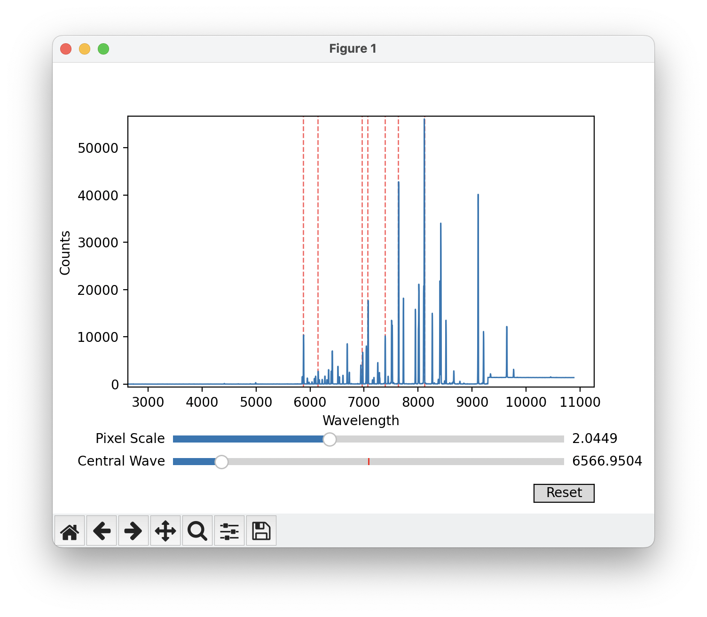
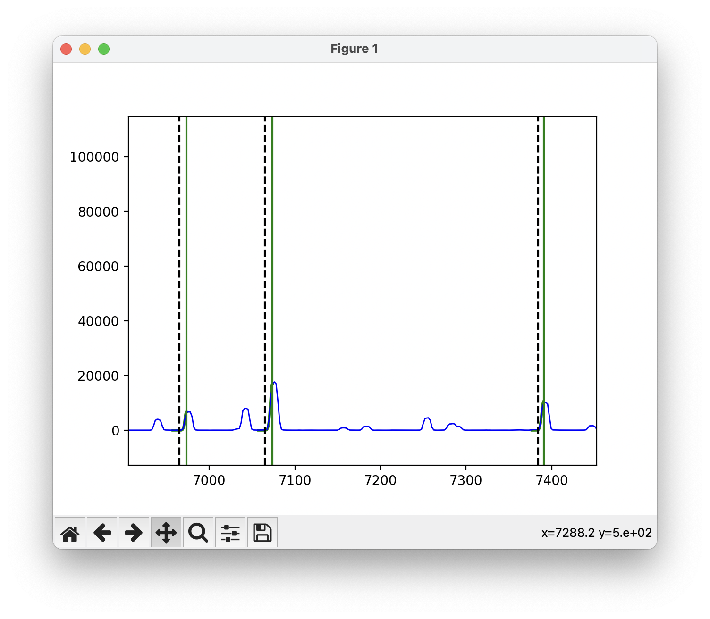
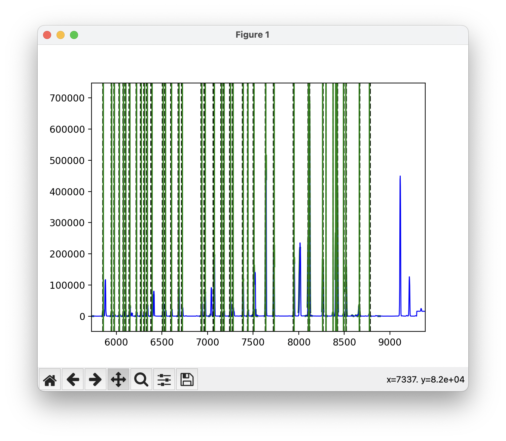
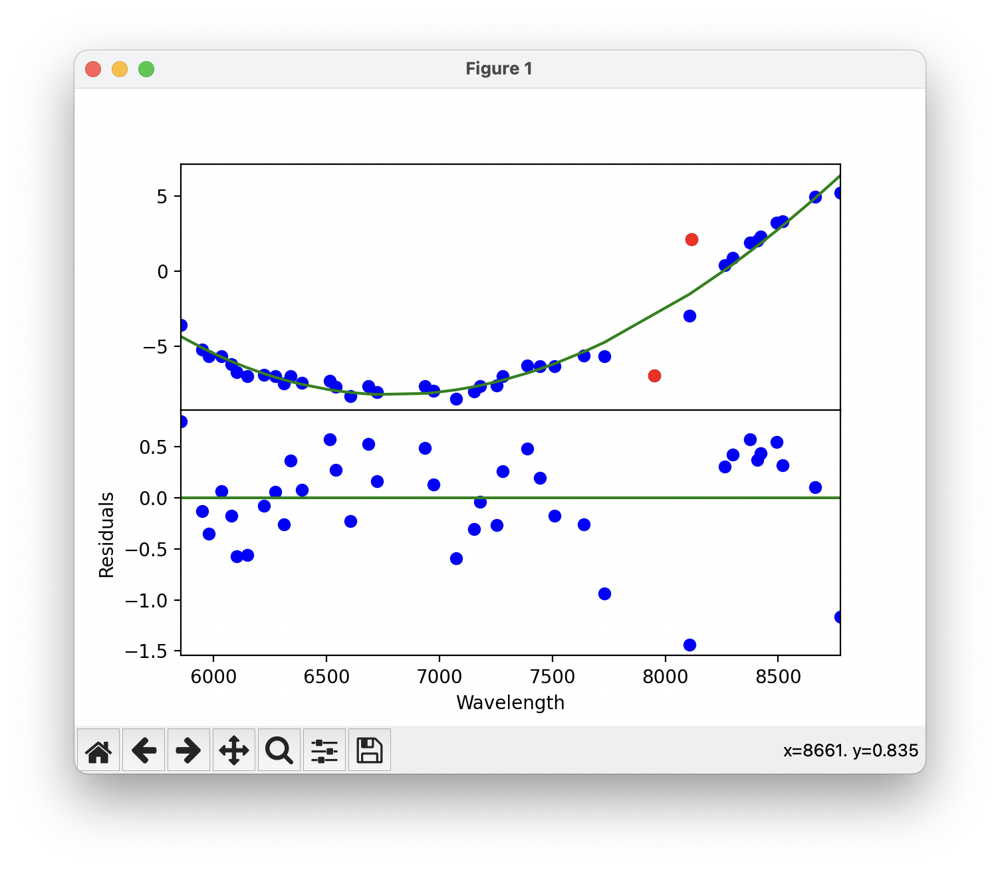
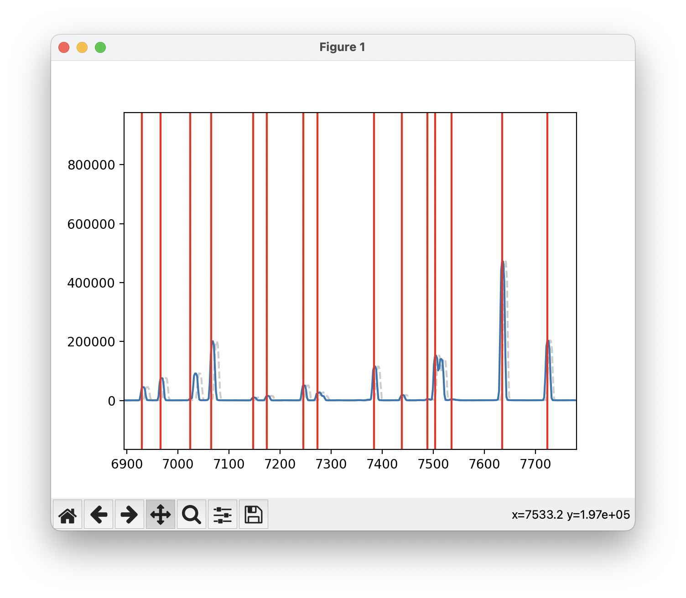

.. _correct_wavelength:

Correct Wavelength
==================

The ``2_Correct_Wavelength.py`` script is used to assign a wavelength solution to all the spectral files, finding a correspondence
between the pixel values and the wavelength values. The script will use the provided calibration files to find common lines,
fit a polynomial to the pixel values, and save the output in the format that IRAF expects. The default file with reference lines
is the ``HeNeAr.dat`` file, but you can change this to any other file if you are using a calibration lamp different from Helium-Neon-Argon.

Test Solution
-------------

In order to provide a wavelength solution, the code first needs a good estimate of the central wavelength and pixel scale
of the instrument. This can be done interactively with the ``test_solution`` function, which takes in a guess for the central wavelength
and pixel scale, as well as a list of bright lines expected to be in the calibration files. Some examples of ``test_solution`` parameters
for different instruments are provided below.

.. code-block:: python

    # Magellan IMACS
    best_cenwave, best_pix_scale = test_solution('AT2022xzc', 6760.598193256596, 1.2924859110989577, bright_lines = [5875.6201,6143.0620,6965.4302,7065.1899,7383.9790,7635.1060,8115.311], arc_name = 'HeNeAr')

    # MMT Binospec 270
    best_cenwave, best_pix_scale = test_solution('AT2022xzc', 6498.935234323291, 1.3153992225382212, bright_lines = [4471.4790, 5015.6782, 5875.6201, 6678.1489, 7503.8682, 8424.6475], arc_name = 'HeNeAr')

    # MMT Binospec 600
    best_cenwave, best_pix_scale = test_solution('AT2022xzc', 5198.136225008471, 0.6039986445272788, bright_lines = [4471.4790, 5015.6782, 5875.6201], arc_name = 'HeNeAr')

    # FLWO FAST
    best_cenwave, best_pix_scale = test_solution('AT2022xzc', 5417.750255333858, 1.4738304408766751, bright_lines = [3944.032, 3961.527, 6965.43, 7383.98], arc_name = 'COMP')

    # WHT Red arm
    best_cenwave, best_pix_scale = test_solution('AT2022xzc_Redarm', 7880.226401767293, 1.8169057208729056, bright_lines = [5852.49,5944.83,5975.53,6074.34,6143.06,6217.28,6266.50,6334.43,6382.99,6402.25,6506.53,6532.88,6598.95,6677.282,6678.20,6752.834,6766.612,6871.289,6937.664,6965.431,7030.251,7067.218,7272.936,7383.981,7514.652,7503.869,7635.106,7724.63,7948.176,8006.157,8014.786,8115.311,8103.693,8264.5225,8424.6475,8408.210,8521.4422,9122.9674,9657.786,9784.503 ], arc_name = 'arc')    individual_flats('Flat_Bluearm', 'field', extension=1, bias_file='bias_Redarm/Bias.fits')

    # WHT Blue arm
    best_cenwave, best_pix_scale = test_solution('AT2022xzc_Bluearm', 4782.2426, 1.6283, bright_lines = [4052.92,4072.00,4103.91,4131.72,4158.59,4181.88,4199.89,4237.22,4259.36,4277.53,4300.10,4348.06,4370.75,4426.00,4481.81,4510.73,4545.05,4579.35,4609.57,4657.90,4726.87,4764.86,4806.02,4847.81,4879.86,4965.08,5017.16,5062.04,5105.54,5218.20,5292.52,5421.35,5495.87,5606.73,5852.49,5944.83,5975.53,6074.34,6143.06,6217.28,6266.50,6334.43,6382.99,6402.25,6506.53,6532.88,6598.95,6677.282,6678.20,6752.834,6766.612,6871.289,6937.664,6965.431,7030.251,7067.218,7272.936,7383.981,7514.652], arc_name = 'arc')

    # Magellan LDSS 1x1 binning
    best_cenwave, best_pix_scale = test_solution('AT2022xzc', 6943.152292822476, 2.0448779485781823, bright_lines = [5875.6201,6143.0620,6965.4302,7065.1899,7383.9790,7635.1060,8115.311], arc_name = 'HeNeAr')

    # Magellan LDSS 2x2 binning
    best_cenwave, best_pix_scale = test_solution('AT2022xzc', 7031, 4.09, bright_lines = [5875.6201,6143.0620,6965.4302,7065.1899,7383.9790,7635.1060,8115.311], arc_name = 'HeNeAr')

    # SOAR Goodman
    best_cenwave, best_pix_scale = test_solution('AT2022xzc', 6929.480875255485, 1.9787042418282716, bright_lines = [6096.1631, 6266.4951, 6382.9912, 6506.5278, 6678.1489, 7438.8979, 7723.7598, 8118.5488], arc_name = 'comp')

    # APO Kosmos
    best_cenwave, best_pix_scale = test_solution('AT2022xzc', 7461.013780468766, 1.0014570611009306, bright_lines = [6402.246, 7032.413, 7245.166, 7438.898], arc_name = 'Comp')

    # Gemini GMOS G400
    best_cenwave, best_pix_scale = test_solution('AT2022xzc', 6488.678602056127, 1.5347941028704617, bright_lines = [6965.4307,7067.2181,7503.8691,7635.1060, 8667.9442], arc_name = 'Arc')

    # Gemini GMOS G150
    best_cenwave, best_pix_scale = test_solution('AT2022xzc', 8641.0, 3.959700562323059, bright_lines = [6965.4307,7067.2181,7503.8691,7635.1060, 8667.9442], arc_name = 'Arc')

This will launch a window such as the one shown below, where you can manually adjust the pixel scale and central wavelength to match the
calibration lines. Usually, the central wavelength is the only parameter that needs to be adjusted, unless the spectrum is binned.

    Window displayed by the ``test_solution`` function, used to adjust the central wavelength and pixel scale of the instrument.

When you are happy with your choice and can see that the selected lines overlap with lines in the spectrum, you can close the window.
The code will then proceed to the next plot, which will show the lines identified in the spectrum as vertical green lines, as well as the
polynomial fit to the lines. Make sure that enough of the lines are correctly identified.

    Diagnosis plot to check that enough of the arc lamp lines were identified.

If everything looks good, simply close the window and the code will save the best values of the central wavelength and pixel scale
to the ``best_cenwave`` and ``best_pix_scale`` variables, respectively.

Apply Solution
--------------

Once the best values for the central wavelength and pixel scale have been found, the ``wavelength_solution`` function can be ran 
on each of the objects to assign a wavelength solution to the spectral files. The function takes in the best values for the central
wavelength and pixel scale, as well as the calibration files and the name of the arc file. Some examples of ``wavelength_solution``
parameters for different instruments are provided below. Note that we set a minimum and maximum wavelength for some instruments to
to only include the region where the calibration lines are present and avoid spurrious fits.

A 3rd order polynomial is usually good enough for most instruments. If desired, you can change the order using the ``order`` parameter
to a 1st, 2nd, or 4th order polynomial.

.. code-block:: python

    # Magellan IMACS
    wavelength_solution('AT2022xzc', 'spec', best_cenwave , best_pix_scale, arc_name = 'HeNeAr', min_wave = 5500, max_wave = 7800)

    # MMT Binospec 270
    wavelength_solution('AT2022xzc', 'spec', best_cenwave , best_pix_scale, arc_name = 'HeNeAr', min_wave = 4000, max_wave = 8550)

    # MMT Binospec 600
    wavelength_solution('AT2022xzc', 'spec', best_cenwave , best_pix_scale, arc_name = 'HeNeAr', min_wave = 4000, max_wave = 8550)

    # FLWO FAST
    wavelength_solution('AT2022xzc', 'AT2022xzc', best_cenwave , best_pix_scale, arc_name = 'COMP', min_wave = 4050, max_wave = 7800)

    # WHT Red arm
    wavelength_solution('AT2022xzc_Redarm', 'AT2022xzc', best_cenwave , best_pix_scale, arc_name = 'arc', lamp_file = 'CuArNe_red.dat')

    # WHT Blue arm
    wavelength_solution('AT2022xzc_Bluearm', 'AT2022xzc', best_cenwave , best_pix_scale, arc_name = 'arc', lamp_file = 'CuArNe_blue.dat', min_wave = 4000)

    # Magellan LDSS 1x1 binning
    wavelength_solution('AT2022xzc', 'AT2022xzc', best_cenwave , best_pix_scale, arc_name = 'HeNeAr', min_wave = 5500)

    # Magellan LDSS 2x2 binning
    wavelength_solution('AT2022xzc', 'AT2022xzc', best_cenwave , best_pix_scale, arc_name = 'HeNeAr', min_wave = 5500)

    # SOAR Goodman
    wavelength_solution('AT2022xzc', 'AT2022xzc', best_cenwave , best_pix_scale, arc_name = 'comp', min_wave = 5500, max_wave = 8500)

    # APO Kosmos
    wavelength_solution('AT2022xzc_red', 'Object', best_cenwave , best_pix_scale, arc_name = 'Comp', min_wave = 6000, max_wave = 8000, order = 2)

    # Gemini GMOS G400
    wavelength_solution('AT2022xzc' , 'AT2022xzc' , best_cenwave , best_pix_scale, arc_name = 'Arc', min_wave = 6000, max_wave = 8300)

    # Gemini GMOS G150
    wavelength_solution('AT2022xzc' , 'AT2022xzc' , best_cenwave , best_pix_scale, arc_name = 'Arc', min_wave = 6000, max_wave = 8300)

The first plot of the ``wavelength_solution`` function will show the arc lamp spectrum with all the lines identified,
and a Gaussian fit to each of the files. Here you just need to make sure that enough lines were found.

    Arc lamp spectrum with all the lines identified and a Gaussian fit to each of the lines.

Simply close the window to go to the next plot, which will show the best fit polynomial to the wavelength solution.
The upper plot shows the best fit, with each line found shown in blue and all excluded lines shown in red. The lower plot
shows the residuals of the fit.

    Best fit polynomial to the wavelength solution. Each point is a line that was identified in the arc lamp spectrum.
    Red points are lines that were excluded from the fit.

If everything looks good, simply close the window and the code will proceed to the next plot. This plot will display the
input spectrum in gray, as well as the output calibrated spectrum in blue. The central wavelengths of the lines are shown
as vertical red lines. You want to make sure the peaks of the blue spectrum match the central wavelengths of the red lines.

    Input spectrum in gray and output calibrated spectrum in blue. The red vertical lines are the true central wavelengths of the arc lines.

Finally, close the last window and the code will save the wavelength solution to the ``database`` directory with the name ``id`` plus
the filename. Finally, the code will modify the header of the spectral files to include the wavelength solution. The code will 
prompt you if you want to add the wavelength solution to the header, type ``yes`` to proceed.

.. code-block:: bash

    add AT2022xzc/AT2022xzc_ccd0091c1_BiasFlatSkyOut.fits,REFSPEC1 = HeNeAr_ccd0101c1_BiasFlatOut
    update AT2022xzc/AT2022xzc_ccd0091c1_BiasFlatSkyOut.fits ? (yes): 

Once this step is complete, you can proceed to the :ref:`Flux Correction <flux_correction>` tutorial.
