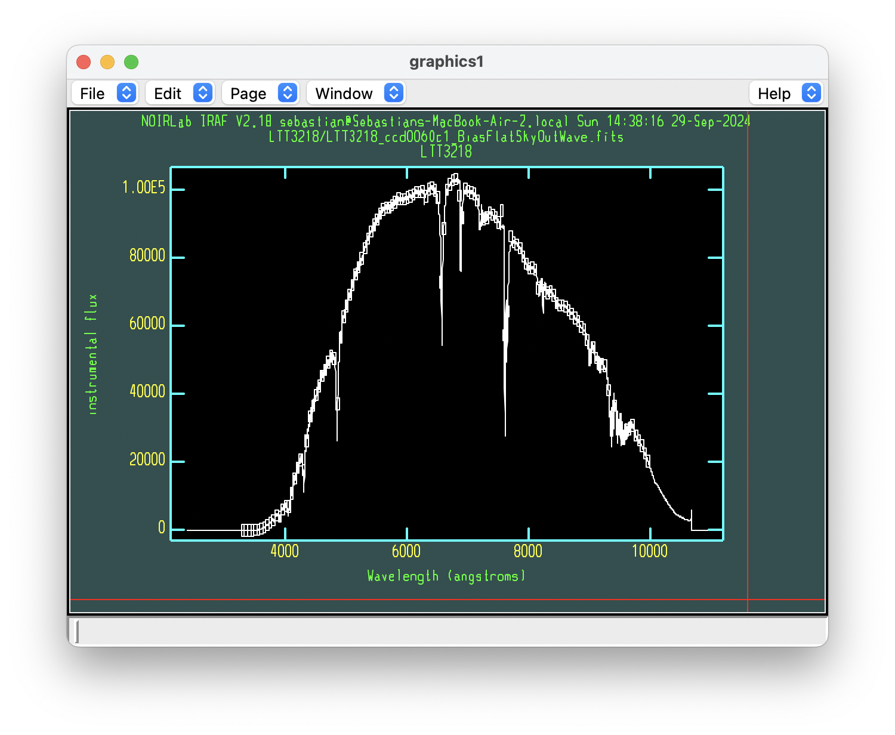
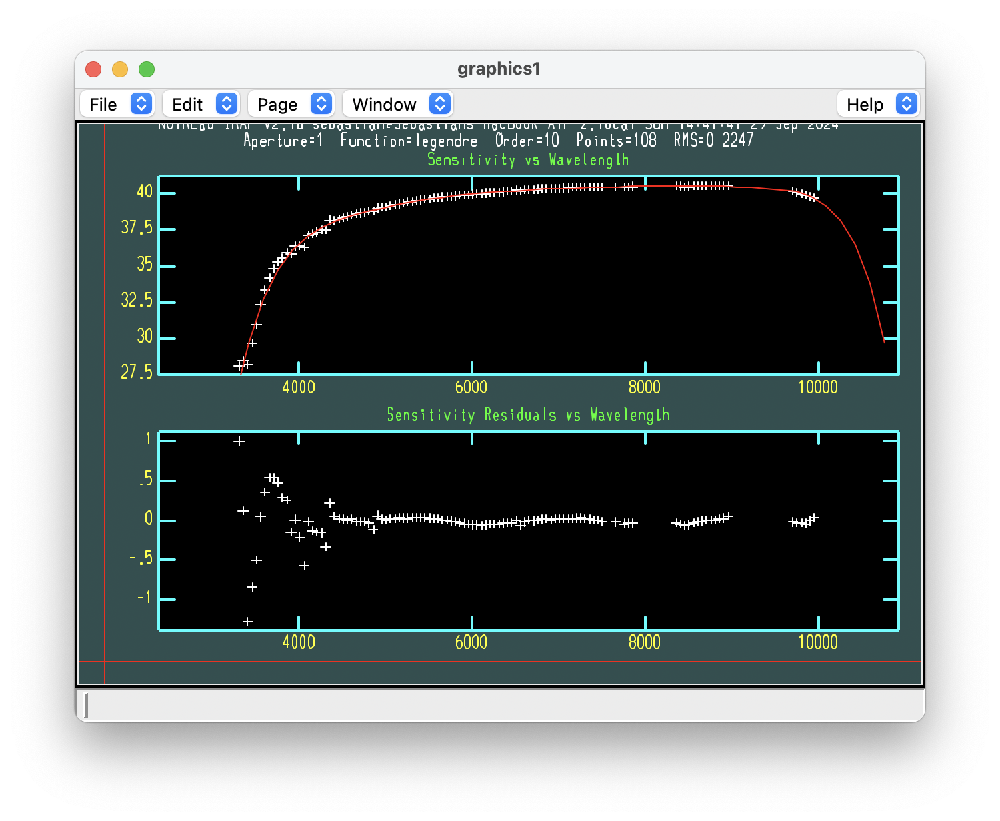

.. _flux_correction:

Flux Correction
===============

The ``3_Flux_Correction.py`` script requires the spectrum of a standard star you observed, as well as the internal calibration
files in IRAF. The functions are used to create a sensitivity function from the standard star spectrum, and then apply that
sensitivity function to the science targets.

Create Sensitivity File
-----------------------

The first step is to create a sensitivity file, which is a file that contains the sensitivity of the instrument as a function
of wavelength derived from the standard star spectrum. The ``create_standard_sensfunc`` function takes in the name of the
standard in your current directory, the name of that standard in the IRAF database, and the name of the directory database
where the calibration files are stored.

.. code-block:: python

    create_standard_sens('LTT3218' , 'LTT3218' , 'l3218', iraf_directory = 'ctionewcal')

.. warning::

    I have coded this up in a terrible way that requires you to manually specify the location of 
    the IRAF database since this was the least crashy option for IRAF. See the commented out lines 
    in the `standard` function for some common options. Modify the ``extinction`` and ``caldir`` 
    variables to match your setup.

This function will display an interactive window from where you can adjust which regions to use for the flux calibration.
In general, you want to remove anything not related to the star, which usually only involves removing telluric absorption regions.
You can remove boxes by clicking `d` while having the red cross-hairs on top of the box you want to delete.

    Sensitivity function derived from the standard star spectrum. The individual boxes represent the regions used for the fit.

If everything looks good, press ``q`` to quit and go to the next step. The next plot shows the best fit to the sensitivity
function. In here you can adjust the order of the fit by typing ``:`` which will launch a prompt window where you can change
the parameters of the fit. Press ``Enter`` to implement the changes. You can also delete points with the ``d`` key and undelete
them with the ``u`` key. Generally, you want the edges of the sensitivity function to not explode to large values.

    Best fit to the sensitivity function.

If everything looks good, press ``q`` to quit and save the sensitivity function.

Flux Calibration
----------------

The next step is to flux calibrate the science targets. The ``iraf_standard`` function takes in the name of the object
you want to flux calibrate, as well as the name of the sensitivity function you just created. An example shown below.

.. code-block:: python

    iraf_standard('AT2022xzc', 'AT2022xzc', 'sens_l3218.fits')

There is not much to do with this function, other than making sure the WARNING that shwos how many pixels were outside the
sensitivity function is not too large. If it is, you may need a different standard or calibration directory.

How to Pick a Standard
----------------------

In the example shown here we have already selected the ``LTT3218`` standard star with a name of ``l3218`` in the 
calibration directory ``ctionewcal``. First, you need to make sure your standard star is one in the IRAF database.
Then, you need to find the name of your star in the calibration directory. Finally, you need to choose which directory
has the best calibration file for your standard. Generally, you want to pick one with the best wavelength coverage.
A list of all the standard stars found in IRAF and their corresponding calibration directories is shown below.

.. code-block:: bash

    Standard stars in onedstds$bstdscal/

    hr718        hr3454       hr3982       hr4468       hr4534
    hr5191       hr5511       hr7001       hr7596       hr7950
    hr8634       hr9087       hd15318      hd74280      hd100889
    hd188350     hd198001     hd214923     hd224926

    --------------------------------------------------------------------------------
    Standard stars in onedstds$ctiocal/

    bd25            eg139           feige56         l2415           l93080
    bd73632         eg149           feige98         l2511           l97030
    bd8             eg158           g16350          l3218           lds235
    cd32            eg248           g2631           l3864           lds749
    eg11            eg274           g9937           l4364           ltt4099
    eg21            f15             h600            l4816           ltt8702
    eg26            f25             hz2             l6248           ross627
    eg31            f56             hz4             l7379           w1346
    eg54            f98             hz15            l7987           w485a
    eg63            f110            kopf27          l8702           wolf1346
    eg76            feige110        l377            l9239           wolf485a
    eg79            feige15         l1020           l9491
    eg99            feige25         l1788           l74546

    --------------------------------------------------------------------------------
    Standard stars in onedstds$ctionewcal/:

    Combined red and blue 3300A-10000A:

    cd32            f56             l2415           l4364           l7987    
    eg21            h600            l3218           l4816           l9239    
    eg274           l1020           l377            l6248           l9491    
    f110            l1788           l3864           l7379           l745    

    Blue 3300A-7550A:

    cd32blue        f56blue         l2415blue       l4364blue       l7987blue    
    eg21blue        h600blue        l3218blue       l4816blue       l9239blue    
    eg274blue       l1020blue       l377blue        l6248blue       l9491blue    
    f110blue        l1788blue       l3864blue       l7379blue    

    Red 6050A-10000A:

    cd32red         f56red          l2415red        l4364red        l7987red    
    eg21red         h600red         l3218red        l4816red        l9239red    
    eg274red        l1020red        l377red         l6248red        l9491red    
    f110red         l1788red        l3864red        l7379red        l745red    

    --------------------------------------------------------------------------------
    Standard stars in onedstds$iidscal/

    40erib       eg50         eg149        g16350       hz4          lds235b
    amcvn        eg54         eg158        g191b2b      hz7          lds749b
    bd253941     eg63         eg162        g2610        hz14         lft1655
    bd284211     eg67         eg182        g2631        hz15         lp414101
    bd332642     eg71         eg184        g4718        hz29         ltt13002
    bd404032     eg76         eg193        g88          hz43         ltt16294
    bd73632      eg77         eg247        g9937        hz44         ltt4099
    bd7781       eg79         eg248        gd128        kopff27      ltt8702
    bd82015      eg91         feige15      gd140        l13633       ross627
    eg11         eg98         feige24      gd190        l140349      ross640
    eg20         eg99         feige25      gh7112       l14094       sa29130
    eg26         eg102        feige34      grw705824    l151234b     sao131065
    eg28         eg119        feige56      grw708247    l74546a      ton573
    eg29         eg129        feige92      grw738031    l8702        wolf1346
    eg31         eg139        feige98      he3          l93080       wolf485a
    eg33         eg144        feige110     hiltner102   l97030       
    eg39         eg145        g12627       hiltner600   lb1240       
    eg42         eg148        g14563       hz2          lb227        

    --------------------------------------------------------------------------------
    Standard stars in onedstds$irscal/

    bd082015     eg50         feige34      hd117880     hd60778      hr7001
    bd174708     eg71         feige56      hd161817     hd74721      hz44
    bd253941     eg139        feige92      hd17520      hd84937      kopff27
    bd262606     eg158        feige98      hd192281     hd86986      wolf1346
    bd284211     eg247        feige110     hd19445      he3          
    bd332642     feige15      g191b2b      hd217086     hiltner102   
    bd404032     feige25      hd109995     hd2857       hiltner600   

    --------------------------------------------------------------------------------
    Standard stars in onedstds$oke1990/

    bd284211  feige110  feige67   g191b2b   g249      gd248     ltt9491   eg71
    bd75325   feige34   g13831    g19374    gd108     hz21      eg158     eg247

    --------------------------------------------------------------------------------
    Standard stars in onedstds$redcal/

    40erib     eg63       eg139      eg248      gd140      hz44       ltt16294
    amcvn      eg67       eg144      feige24    gd190      l13633     ltt4099
    bd7781     eg76       eg145      g12627     grw705824  l14094     ltt8702
    bd73632    eg79       eg148      g14563     grw708247  l151234b   ross627
    bd174708   eg91       eg149      g16350     grw738031  l74546a    ross640
    bd262606   eg98       eg162      g191b2b    hd19445    l93080     sa29130
    eg20       eg99       eg182      g2610      hd84937    l97030     sao131065
    eg33       eg102      eg184      g2631      he3        lds235b    wolf1346
    eg50       eg119      eg193      g4718      hz29       lds749b    wolf485a
    eg54       eg129      eg247      g9937      hz43       lft1655    

    --------------------------------------------------------------------------------
    Standard stars in onedstds$spec16cal/:

    Combined red and blue 3300A-10300A:

    hd15318      hd74280      hd114330     hd188350     hd214923
    hd30739      hd100889     hd129956     hd198001     hd224926
    hr1544       hr4468       hr5501       hr7596       hr8634       
    hr3454       hr4963       hr718        hr7950       hr9087    

    Blue 3300A-7550A:

    hd15318blue     hd74280blue     hd114330blue    hd188350blue    hd214923blue
    hd30739blue     hd100889blue    hd129956blue    hd198001blue    hd224926blue
    hr1544blue      hr4468blue      hr5501blue      hr7596blue      hr8634blue    
    hr3454blue      hr4963blue      hr718blue       hr7950blue      hr9087blue    

    Red 6020A-10300A:

    hd15318red      hd74280red      hd114330red     hd188350red     hd214923red
    hd30739red      hd100889red     hd129956red     hd198001red     hd224926red
    hr1544red       hr4468red       hr5501red       hr7596red       hr8634red    
    hr3454red       hr4963red       hr718red        hr7950red       hr9087red    

    --------------------------------------------------------------------------------
    Standard stars in onedstds$spec50cal/  (3200A - 8100 A)

    bd284211   eg247      feige34    hd192281   pg0205134  pg0934554  wolf1346
    cygob2no9  eg42       feige66    hd217086   pg0216032  pg0939262  
    eg139      eg71       feige67    hilt600    pg0310149  pg1121145  
    eg158      eg81       g191b2b    hz14       pg0823546  pg1545035  
    eg20       feige110   gd140      hz44       pg0846249  pg1708602  

    Standard stars in onedstds$spec50cal/  (3200A - 10200A)

    bd284211   eg247      feige34    g191b2b    hz44       
    eg139      eg71       feige66    gd140      pg0823546  
    eg158      feige110   feige67    hilt600    wolf1346   

    --------------------------------------------------------------------------------
    Standard stars in onedstds$spechayescal/

    bd284211     eg139        feige67      hd217086     pg0216032    pg0939262
    cygob2no9    eg158        feige110     hiltner600   pg0310149    pg1121145
    eg42         eg247        g191b2b      hz14         pg0823546    pg1545035
    eg71         feige34      gd140        hz44         pg0846249    pg1708602
    eg81         feige66      hd192281     pg0205134    pg0934554    wolf1346

Once you have completed the flux calibration, you can proceed to the :ref:`Plot Data <plot_data>` tutorial.
