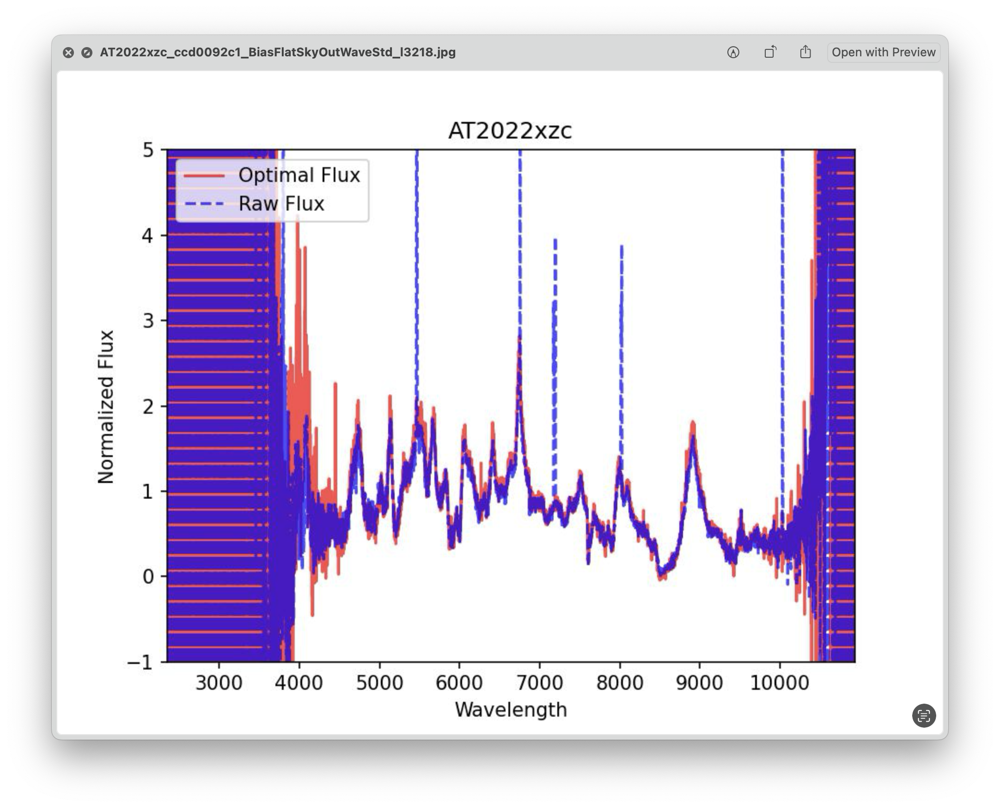
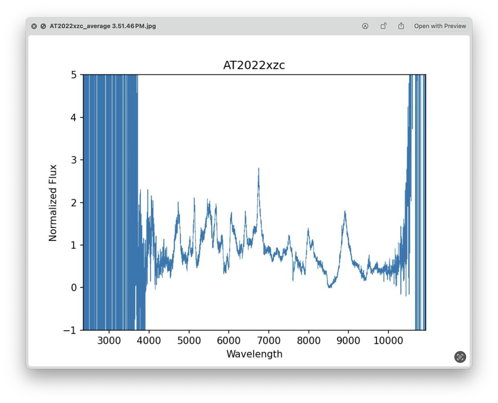

.. _plot_data:

Plot Data
=========

The ``4_PlotMolly.py`` script will plot the data for each object in the dataset. The name of this file comes after Molly,
a 1D spectrum analysis code written by Tom Marsh. The original functions from Molly are no longer validated,
but the plotting functions are still useful for visualizing the data.

.. warning::

    IRAF tends to complain if file names are too long. Therefore, the script is very hacky and 
    renames the names of your target directories to ``A`` before running the IRAF functions,
    and then renames it back to the original name. This is a terrible solution, but it is what it is for now.

To run this script simply run the ``all_in_one`` function with the name of the object you want to plot. As usual,
the first argument is the name of the directory, and the second argument is the format of the name of the object.

.. code-block:: python

    all_in_one('AT2022xzc', 'AT2022xzc')

This script will output a plot and a corresponding ASCII file for each individual spectrum, as well as one for 
the combined spectrum. The plots for the individual spectra show two spectra, one that is optimally extracted 
and one that is extracted using a simple method. Usually optimal extraction is better, but sometimes it can fail
if there are cosmic rays or other unexpected issues. The optimal extraction has the added benefit that it automatically
gets rid of cosmic rays. Make sure to check the optimal extraction against the simple extraction to make sure they
are consistent.

    Example of an extracted spectrum. The red line is the optimal extraction, and the blue line is the simple extraction.

Finally, you can admire the final spectrum saved in the specif object directory. Note that in this case, the reddest and bluest
regions of the spectrum are very noisy. The blue region is noisy since there simply is no data there, while the red region was
affected by the calibration.

    Example of a final extracted spectrum.

The final data will be saved inside your object directory in a file called ``AT2022xzc/AT2022xzc_average.txt``. The first
column is the wavelength in Angstroms, the second column is the flux in erg/s/cm^2/Angstrom, and the third column is the error
in the flux.