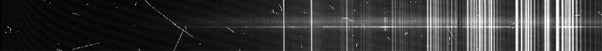

.. _prepare_data:

Prepare Data
============

.. warning::
   You need to run each script individualy and quit your Python instance before running the next script to prevent them from crashing.

The ``RedSpec`` package expects files to be formatted in a specfic way and specfic directory structure. The first script, ``0_Prepare_Data.py``,
will process the input data, modify it, and sort it into the correct directory structure. To begin, you should place all of
your raw ``.fits`` files in a single directory, by default called ``raw_data``. This directory should be in the same place
as the ``RedSpec`` scripts.

An example directory structure is shown below. It is not immediately obvious which files are bias, flats, calibration, or science frames,
but the script will read the header information to sort them into more meaningful directories.

.. code-block:: text

    0_Prepare_Data.py

    raw_data/
    ├── ccd0001c1.fits
    ├── ccd0002c1.fits
    ├── ccd0003c1.fits
    ├── ccd0004c1.fits
    ├── ccd0005c1.fits
    ├── ...

The ``prepare_data`` function will read in these files as well as their header information to sort them into their respective
directories and setup a directory structure such as this one:

.. code-block:: text

    bias/
    ├── Bias_ccd0001c1.fits
    ├── Bias_ccd0002c1.fits
    ├── Bias_ccd0003c1.fits
    ├── ...

    AT2022xzc/
    ├── AT2022xzc_ccd0091c1.fits
    ├── AT2022xzc_ccd0092c1.fits
    ├── AT2022xzc_ccd0093c1.fits
    ├── Flat_QH_ccd0095c1.fits
    ├── HeNeAr_ccd0101c1.fits

    LTT3218/
    ├── Flat_QH_ccd0062c1.fits
    ├── HeNeAr_ccd0061c1.fits
    ├── LTT3218_ccd0060c1.fits

The first directory is a ``bias`` directory that contains all the bias files. Each additional directory (e.g. ``2022xzc``) contains the 
science targets, as well as their corresponding calibration files such as flats and arcs. Note that the actual names of the objects and
calibrations depend on the information retrieved from the headers. Alternatively, if you have a single set of flats for the entire dataset,
you can leave out the individual flats from each directory.

Once the data is sorted, the script will modify each file to be in the required format. The scrips expect each files to be a
1D spectrum with a single object near the center oriented with the wavelength increasing along the x-axis and the spatial
direction along the y-axis. Therfore, the script will either rotate, flip, or crop each input ``.fits`` file
from ``raw_data`` into the expected format. An example image of how the spectrum files should look is shown below.

    Example of a 1D spectrum from LDSS3c. Cropped to have the target trace near the center, with wavelength increasing
    along the x-axis, and the spatial direction along the y-axis.

Running the script
------------------

When running the ``0_Prepare_Data.py`` script, we recommend you start by running the ``extract_fits_info`` function, which creates a "nightlog"
style file with all the information extracted from the headers of the input ``.fits`` files. Since the header keywords vary from instrument to
instrument, you will need to modify the parameters of the function to match the instrument you are using. Some examples of parameters that can be
read with ``extract_fits_info`` for different instruments are provided below.

.. code-block:: bash

    # Magellan IMACS 
    extract_fits_info('raw_data/*c8.fits', ['OBJECT', 'EXPTYPE', 'EXPTIME', 'RA', 'DEC', 'DATE-OBS', 'TIME-OBS', 'FILTER', 'DISPERSR', 'BINNING', 'AIRMASS'])

    # MMT Binospec
    extract_fits_info('raw_data/*.fits', ['OBJECT', 'IMAGETYP', 'SCRN', 'EXPTIME', 'RA', 'DEC', 'DATE-OBS', 'FILTER', 'MASK', 'DISPERS1', 'DISPERS2', 'HENEAR', 'MJD', 'AIRMASS', 'EXPMODE', 'PI'], header_index = 1, data_index = 1)

    # FLWO FAST 
    extract_fits_info('raw_data/*.fits', ['OBJECT', 'EXPTIME', 'RA', 'DEC', 'DATE', 'APERTURE', 'DISPERSE'])

    # WHT 
    extract_fits_info('raw_data/*.fits', ['OBSTYPE',  'OBJECT', 'EXPTIME', 'RA', 'DEC', 'DATE-OBS', 'UT', 'AIRMASS', 'ISISLITW', 'DISPERSI', 'ISIFILTA', 'ISIFILTB', 'ISIGRAT', 'ISIARM', 'CENWAVE'])

    # Magellan LDSS 
    extract_fits_info('raw_data/*c1.fits', ['OBJECT', 'EXPTYPE', 'EXPTIME', 'BINNING', 'RA', 'DEC', 'DATE-OBS', 'TIME-OBS', 'FILTER', 'GRISM'])

    # MMT Blue Channel 
    extract_fits_info('raw_data/*.fits', ['IMAGETYP', 'OBJECT', 'EXPTIME', 'RA', 'DEC', 'DATE-OBS', 'UT', 'AIRMASS', 'APERTURE', 'DISPERSE', 'CENWAVE'])

    # SOAR Goodman 
    extract_fits_info('original/*.fits.fz', ['OBSTYPE', 'OBJECT', 'EXPTIME', 'RA', 'DEC', 'DATE-OBS', 'UT', 'AIRMASS', 'FILTER', 'FILTER2', 'GRATING', 'SLIT'], header_index = 1, data_index = 1)

    # APO Kosmos 
    extract_fits_info('raw_data/*.fits', ['OBJNAME','RA','DEC','DATE-OBS','IMAGETYP','EXPTIME','DISPERSR','QUARTZ','NEON','SLIT','FILTER2','FILTER1'])

    # Gemini GMOS 
    extract_fits_info('input/*.fits', ['OBJECT', 'OBSTYPE', 'OBSCLASS', 'EXPTIME', 'RA', 'DEC', 'WAVELENG', 'UT', 'DATE', 'DETECTOR', 'CONID', 'SHUTTER', 'FILTER1', 'FILTER2', 'GRATING', 'GAIN', 'RDNOISE', 'CCDSUM', 'GRTILT'])

After running this function, you can then run the main ``prepare_data`` function, which will sort and modify each input file.
Again, a list of examples for different instruments is provided below.

.. code-block:: bash

    # Magellan IMACS 
    prepare_data('raw_data/*c8.fits', variables = [''], rotate = True, crop = True, break_character = ' ', instrument = 'IMACS1')

    # MMT Binospec 270
    prepare_binospec()

    # MMT Binospec 600
    prepare_binospec(disperser_name = 'x600')

    # FLWO FAST 
    prepare_data(variables = [''], rotate = False, crop = False, break_character = '', disperser = 'DISPERSE', filter_name = '')

    # WHT 
    prepare_data(variables = ['ISIARM'], rotate = True, crop = True, break_character = ' ', disperser = 'ISIGRAT', filter_name = '', datasec_key = 'RTDATSEC', data_index = 1, rotations = 1)

    # Magellan LDSS 
    extract_fits_info('raw_data/*c1.fits', ['OBJECT', 'EXPTYPE', 'EXPTIME', 'BINNING', 'RA', 'DEC', 'DATE-OBS', 'TIME-OBS', 'FILTER', 'GRISM'])

    # MMT Blue Channel 
    prepare_data(variables = [''], rotate = False, crop = True, break_character = ' ', disperser = 'DISPERSE', filter_name = '', instrument = 'BlueChannel')

    # SOAR Goodman
    pre_prepare_data('original/*.fits.fz')
    prepare_data('raw_data/*.fits.fz', variables = [''], rotate = False, crop = True, break_character = ' ', disperser = 'GRATING', filter_name = '', instrument = 'Goodman', header_index = 0, data_index = 0)

    # APO Kosmos 
    prepare_data(variables = ['DISPERSR'], rotate = True, crop = True, disperser = 'DISPERSR', instrument = 'Kosmos', filter_name = '', objname = 'IMAGETYP', datasec_key = 'CSEC11', biassec_key = 'BSEC11')

Note that Binospec has its own separate ``prepare_binospec`` function because it requires a slightly different approach.
Similarly, the Goodman instrument at SOAR requires a separate function to extract the data from the ``.fits.fz`` files and turn them 
into regular ``.fits`` files before running the main ``prepare_data`` function.

.. warning::
    Sometimes not all data will be sorted in the right place (e.g. if the calibration files do not have their corresponding target name in the header).
    In this case, you should manually move the files around to match the required structure.
