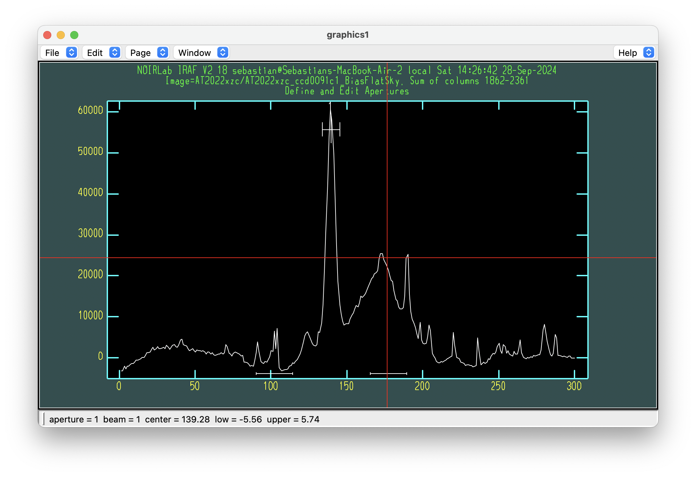
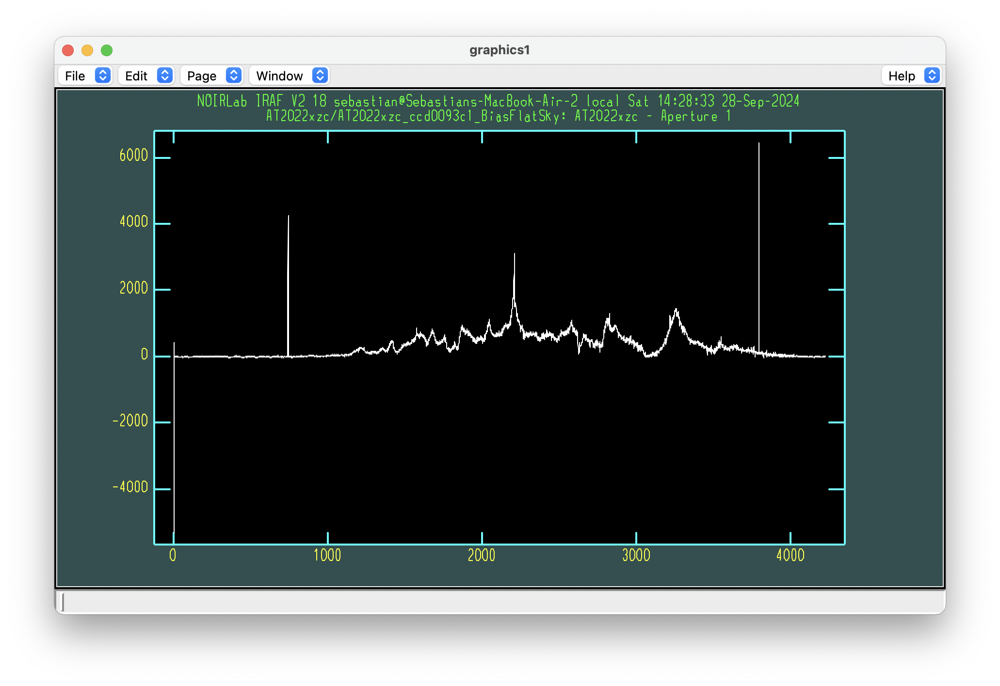

.. _reduce_data:

Reduce data
===========

The ``1_reduce_data.py`` script is the main function of the ``RedSpec`` package. This script is used to reduce the data,
which includes bias and flat field corrections, background subtraction, and trace extraction.

The first step is to create a master bias file. This is done by combining all the bias frames taken during the observation
using the IRAF ``zerocombine`` function with a median filter and an average sigma clipping process. The output file will be
saved as ``bias/Bias.fits``. This process is the same for effectively all instruments and can be done using the
``iraf_zerocombine`` function. Just make sure you select the appropriate extension for your data.

.. code-block:: bash

    iraf_zerocombine('bias', extension = 1)

Once you have the master bias file created, you can run the main ``reduce_data`` function. We provide examples for different
instruments below.

.. code-block:: bash

    # Magellan IMACS
    reduce_data('AT2022xzc', 'AT2022xzc', arc_name='HeNeAr', flat_name='Qh', gain_name='EGAIN', noise_name='ENOISE')

    # MMT Binospec 270
    reduce_data('AT2022xzc', 'spectra', arc_name='HeNeAr', flat_name='flat', extension=1, fixpix=True, fixfile='Binospec_mask.fits')

    # FLWO FAST
    individual_flats('FLAT', 'FLAT')
    reduce_data('AT2022xzc', 'AT2022xzc', arc_name='COMP', flat_name='Qh', do_individual_flats=False, flat_file='FLAT/Flat_norm.fits', gain_name='GAIN', noise_name='RDNOISE')

    # WHT
    individual_flats('Flat_Redarm', 'field', extension=1, bias_file='bias_Redarm/Bias.fits')
    individual_flats('Flat_Bluearm', 'field', extension=1, bias_file='bias_Redarm/Bias.fits')
    reduce_data('AT2022xzc_Redarm', 'AT2022xzc', arc_name='arc', flat_name='Qh', do_individual_flats=False, flat_file='Flat_Redarm/Flat_norm.fits', gain_name='GAIN', noise_name='READNOIS', bias_file='bias_Redarm/Bias.fits', extension=1)

    # Magellan LDSS
    reduce_data('AT2022xzc', 'AT2022xzc', arc_name='HeNeAr', flat_name='Flat', gain_name='EGAIN', noise_name='ENOISE')

    # SOAR Goodman
    reduce_data('AT2022xzc', 'AT2022xzc', arc_name='comp', flat_name='flat', noise_name='RDNOISE')

    # APO Kosmos
    reduce_data('AT2022xzc_blue', 'Object', arc_name='Comp', flat_name='Flat', gain_name=1, noise_name=1)

    # Gemini GMOS
    reduce_data('AT2022xzc', 'AT2022xzc', arc_name='Arc', flat_name='Flat', gain_name='GAIN', noise_name='RDNOISE')

Note that some instruments such as FLWO FAST and WHT are ran with the ``do_individual_flats`` flag set to ``False`` and
the ``flat_file`` flag set to the path of the normalized flat field file. This can be done when there is only one set of
calibration flats for all objects.

The following examples will guide you through the data reduction process using the Magellan LDSS3c spectrograph. While
there are nuances pertaining to different instruments, the general process should be quite similar, assuming you have 
processed the data following the instructions in the :ref:`prepare_data` tutorial.

Bias
----

The first step is to create the master bias file. This is done by combining all the bias frames taken during the
observation using the IRAF ``zerocombine`` function with a median filter and an average sigma clipping process. For LDSS3c,
the extension of the bias is 0, so you can run the following command:

.. code-block:: python

    iraf_zerocombine('bias', extension = 0)

This should result in a ``bias/Bias.fits`` file being created that looks like this:

    Example of a master bias file from LDSS3c created with the ``iraf_zerocombine`` function.

Now you can run the ``reduce_data`` function to reduce the data, where you can see the individual parameter names
needed for the LDSS3c instrument. Note that the first parameter is the name of the directory and the second is the
format of the object name in the files. Sometimes objects will be named with their actual name, like shown here, while
other times they might be named with a generic name such as "spec".

.. code-block:: python

    reduce_data('AT2022xzc', 'AT2022xzc', arc_name='HeNeAr', flat_name='Flat_QH', gain_name='EGAIN', noise_name='ENOISE')

Flat
----

The script will also create a master flat field by combining all the flat field frames taken during the observation using the
IRAF ``flatcombine`` function with a median filter and an average sigma clipping process. The output file will be stored 
in ``AT2022xzc/Flat.fits`` and it looks like this:

    Example of a master flat field from LDSS3c created with the ``iraf_flatcombine`` function.

After these two files have been created, you will be prompted whether you want to fit the normalization spectrum of the
flat field interactively. This is recommended unless you know the data very well and have already chosen the optimal
normalization parameters. If you choose `yes`, a GUI will appear where you can adjust the fit to the flat spectrum.

.. code-block:: bash

    "Fit the normalization spectrum for AT2022xzc/Flat.fits interactively (yes):"

This will launch a windown that looks like this:

    Example of a response function for a flat field.

We want to fit the response function of the flat field with a smooth polynomial. The default is set to a 60th order
polynomial. You can adjust the order of the fit by typing ``:`` which will launch a prompt window where you can change the
parameters of the fit. For example typing ``order 50`` will change the value of the ``order`` parameter to ``50``. 
Press ``Enter`` to implement the changes.

    Example of how to change the order of the fit to 50.

To zoom in on the fit you can press ``w`` to enter zoom mode. Then, you can place the cross-hairs on the bottom left corner
of the zoom region you want and press ``e``. Then, place the cross-hairs on the top right corner of the zoom region and press
``e`` again. You can then use the ``d`` key to delete points closest to the cross-hairs and ``u`` to un-delete them. Points that
are deleted will appear as X's.

You can go back to the full view by pressing ``w`` to enter zoom mode and then pressing ``a`` to show all.

In the example shown below we are deleting the reddest points on the flat spectrum. This is because these are reference pixels
with no flux that should not be included in the fit. Alternatively, you can use the ``response_sample`` parameter to set the range of
pixels you want to fix. Beware that pixels outside the ``response_sample`` range will have no data (e.g. ``None``), whereas deleting
them manually using ``d`` will still include the data in the fit by extrapolating the polynomial.

    Example of a zoomed in response function of a flat file, where we show how you can delete points that you do not want included in the fit.

You can then press ``f`` to re-fit the data with the new parameters and deleted data, and then press ``r`` to re-plot the data
if this does not update automatically. Make sure the fit looks good, and if it does press ``q`` to save and quit the window.

    Example of a good fit to the response function of the flat file.

The script will save the output normalized flat to ``AT2022xzc/Flat_norm.fits``. You should double check the fit by 
opening the normalized flat field, which should look somewhat like this:

    Example of a normalized flat field image.

Notice the "waves" on the left side of the spectrum. These are hard to avoid due to the polynomial fit nature of the process,
but you should try to minimize them as much as possible.

Finally, the script will bias and flat correct all the data using the master bias and flat files created. The output files
will be saved in the ``AT2022xzc`` directory with the suffix ``_BiasFlat.fits``.

Background
----------

The next step is to remove the sky background from each file. The script will use the IRAF ``background`` function to subtract
the background from the science frames. First, you need to select which region to fit the background on. You should pick a 
relatively clean region with most of the trace on it and a clean background. In the example below, we are picking a region
between 1000 and 2400 pixels.

    Example of how to pick a background region based on the trace of the spectrum. The red line shows the limits of
    the region chosen for the background fit.

The first window that will appear after running the script is completely black. Here is where you need to specify 
the region to use to fit for the background.

    Window where you must specify the region to fit the background.

After you press ``Enter`` you will enter the background fitting window. Here you should adjust the parameters of the background
fit. Making sure to remove anything that is not part of the background. Note that in the example below there is a bright galaxy
on top of the target. Usually, you want to only remove non-astrophysical sources to prevent over-subtraction of the background.

    Fit to the background of the science frame, making sure to not include the flux of the galaxy as background.

Alternatively, if you feel confident enough to remove anything that is not your target from the fit, you can include the
galaxy as background, which would look like the example below. Beware that this can lead to over-subtraction effects.

    Fit to the background of the science frame, including the flux of the galaxy as background.

After you are happy with the fit, you can close the window by pressing ``q``, and the script will continue to subtract the
background from the science frames. The subtracted background file will be saved with the suffix ``_BiasFlatSky.fits``. An
example of this file is shown below.

    Example of a background subtracted image where the galaxy trace has not been removed.

Trace
-----

After the background has been subtracted from all science files, the script will ask if you want to recenter, resize, or edit
the apertures. You should do all three.

.. code-block:: bash

    Recenter apertures for AT2022xzc/AT2022xzc_ccd0091c1_BiasFlatSky? ('yes'): 
    Resize apertures for AT2022xzc/AT2022xzc_ccd0091c1_BiasFlatSky? ('yes'): 
    Edit apertures for AT2022xzc/AT2022xzc_ccd0091c1_BiasFlatSky? ('yes'): 

This will launch a window where you can adjust the apertures. The script will pick the brightest object in the image as
the single object to extract. If this is not your target you can place the cursor on top of the target and press ``d`` to
delete the current object. Then move your cursor to where your actual target is and place ``m`` to mark the object.

    Aperture adjustment window. Place an aperture with the ``m`` key on top of your target.

After the target has been identified, the script will fit the trace of the object. This is a necessary step since
the trace will not be centered at the same pixel for all wavelength values. This is due to the intrinsic nature of
instruments. The trace fit should look like the example below.

    Example of a bad fit to a trace.

In this example the fit to the trace is clearly very bad. This is because most of the points on the blue end have
no data, so these should be removed from the fit. Just as we did before, you can delete points by pressing ``d`` and
undelete them by pressing ``u``. You can also change the order of the fit by pressing ``:`` and then typing ``order 3``

    Example of a good fit to a trace.

Once everything looks good you can press ``q`` to save and quit the window. The script will then extract the spectrum
from the science frames. The extracted spectrum will be saved with the suffix ``_BiasFlatSkyOut.fits``. An example of
this file is shown below.

    Example of the final product of the data reduction process, showing a 1D spectrum extracted from the science frame.

Arc Lamp
--------

Throught this process the script will automatically reduce the arc lamp frames. Since these are usually much simpler, no
interaction with them is required. The trace from the arc lamps will be extracted along the same region as the one selected
for the sicence frames. The final extracted spectrum will be saved with the suffix ``_BiasFlatOut.fits``. Obviously without
doing the sky background subtraction, since this would get rid of the lines we want to identify. An example of a corrected
arc lamp is shown below.

    Example of a bias corrected and flat fielded arc lamp spectrum.

Once this step is done, you can move on to the next step, which is the :ref:`Wavelength Correction <correct_wavelength>` tutorial.

